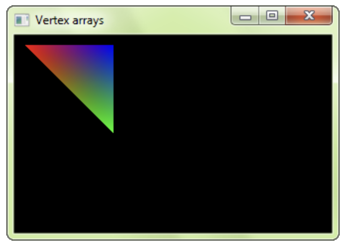

# APIs Gráficas

| Nome             | RA       |
|------------------|----------|
| Gustavo Schwarz  | 10389588 |
| Thales Lopes     | 10389343 |
| Vincenzo Alberice| 10389354 |

Faça uma pesquisa sobre APIs gráficas e elabore um texto descrevendo os resultados da pesquisa contendo:
 - Uma breve descrição da API gráfica que você selecionou para a pesquisa;
 - Como a pipeline é documentada pelos desenvolvedores da API;
 - Quais linguagens de shading (shaders) são suportadas pela API;
 - Um exemplo de código que demonstra o uso da API (pode ser um "Hello, World!"  gráfico – renderizar um triângulo na tela);
 - Um exemplo de código de shader suportado pela API;
 - A descrição de um exemplo de aplicação que usa a API.

---

A Simple and Fast Multimedia Library (SFML) é uma biblioteca de C++ voltada para o desenvolvimento de aplicações multimídia, que abrange recursos de gráficos, áudio, rede e gestão de eventos de sistema. A documentação oficial da SFML é bastante completa e acessível, oferecendo tutoriais, guias de início rápido e uma referência detalhada da API para cada um de seus módulos, disponível através do site oficial do SFML, https://www.sfml-dev.org/documentation/2.6.1/.
No que diz respeito a shaders, a SFML suporta a GLSL (OpenGL Shading Language), permitindo aos desenvolvedores criar e implementar shaders personalizados para efeitos visuais em gráficos 2D. Um exemplo de código de shader em GLSL suportado pela SFML está abaixo:

```glsl
// shader.frag
uniform float offset;
void main() {
    // Aumenta a intensidade da cor de cada fragmento
    gl_FragColor = gl_Color + vec4(offset, offset, offset, 1.0);
}
```

Já um exemplo de código para renderizar um triângulo usando SFML está abaixo, o output produzido pode ser observado na Figura 1.

```c++
#include <SFML/Graphics.hpp>

int main() {
    sf::RenderWindow window(sf::VideoMode(800, 600), "SFML window");
    sf::VertexArray triangle(sf::Triangles, 3);

    // Definindo as posições dos vértices do triângulo
    triangle[0].position = sf::Vector2f(100, 100);
    triangle[1].position = sf::Vector2f(200, 100);
    triangle[2].position = sf::Vector2f(150, 200);

    // Definindo as cores dos vértices
    triangle[0].color = sf::Color::Red;
    triangle[1].color = sf::Color::Blue;
    triangle[2].color = sf::Color::Green;

    while (window.isOpen()) {
        sf::Event event;
        while (window.pollEvent(event)) {
            if (event.type == sf::Event::Closed)
                window.close();
        }

        window.clear();
        window.draw(triangle);
        window.display();
    }

    return 0;
}

```


Figura 1. Triângulo renderizado a partir do código acima. Fonte: https://www.sfml-dev.org/tutorials/2.6/graphics-vertex-array.php.  


Um exemplo prático de aplicação usando SFML poderia ser um jogo de plataforma 2D. Neste jogo, jogadores controlam um personagem que precisa navegar por um ambiente, pulando sobre plataformas e evitando obstáculos assim como Mário. A SFML seria usada para renderizar os gráficos do jogo, capturar inputs de teclado e mouse, e gerenciar a reprodução de sons e músicas. Alguns games feitos com SFML podem ser encontrados em https://sfmlprojects.org/games. 


#### Referências. 

SFML Documentation. Disponível em: https://www.sfml-dev.org/documentation/2.6.1/. Acesso em: 13 maio 2024.

SFML vertex-array. Disponível em: https://www.sfml-dev.org/tutorials/2.6/graphics-vertex-array.php. Acesso em: 13 maio 2024.

SFML projects. Disponível em: https://sfmlprojects.org/games. Acesso em: 13 maio 2024.

