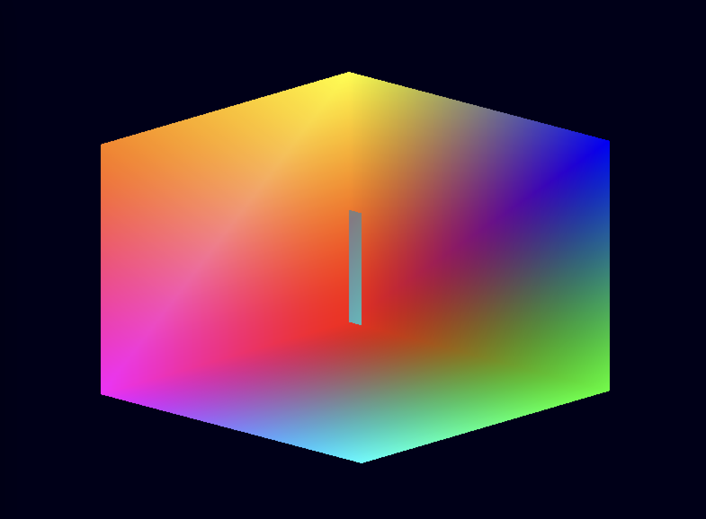

# Transformações

| Nome             | RA       |
|------------------|----------|
| Gustavo Schwarz  | 10389588 |
| Thales Lopes     | 10389343 |
| Vincenzo Alberice| 10389354 |

*O que deve ser alterado no código original para que o programa exiba um cubo de cores que fica girando em um ou mais eixos sem parar?*

Para fazer a rotação do cubo em torno de um eixo, é necessário realizar a multiplicação da matriz de projeção pela matriz de visualização e pela matriz de modelo, e então passar o resultado para o shader. A rotação do cubo pode ser feita em torno de qualquer eixo, mas para este exemplo, será feita em torno do eixo Y.

A mudança feita está no trecho abaixo: 



```c
    // Vértices do cubo
    GLfloat vertices[] = {
        -0.5f, -0.5f, -0.5f, // Vértice 0
        0.5f, -0.5f, -0.5f, // Vértice 1
        0.5f,  0.5f, -0.5f, // Vértice 2
        -0.5f,  0.5f, -0.5f, // Vértice 3
        -0.5f, -0.5f,  0.5f, // Vértice 4
        0.5f, -0.5f,  0.5f, // Vértice 5
        0.5f,  0.5f,  0.5f, // Vértice 6
        -0.5f,  0.5f,  0.5f  // Vértice 7
    };

    // Cores dos vértices
    GLfloat colors[] = {
        1.0f, 0.0f, 0.0f, // Vermelho
        0.0f, 1.0f, 0.0f, // Verde
        0.0f, 0.0f, 1.0f, // Azul
        1.0f, 1.0f, 0.0f, // Amarelo
        1.0f, 0.0f, 1.0f, // Magenta
        0.0f, 1.0f, 1.0f, // Ciano
        0.5f, 0.5f, 0.5f, // Cinza
        1.0f, 0.5f, 0.0f  // Laranja
    };

    ...

    GLuint indices[] = {
        0, 1, 2, 2, 3, 0, // Face traseira
        4, 5, 6, 6, 7, 4, // Face frontal
        4, 5, 1, 1, 0, 4, // Face inferior
        3, 2, 6, 6, 7, 3, // Face superior
        4, 0, 3, 3, 7, 4, // Face esquerda
        1, 5, 6, 6, 2, 1  // Face direita
    };

    // Criação do Vertex Buffer Object (VBO) para índices
    GLuint EBO;
    glGenBuffers(1, &EBO);
    glBindBuffer(GL_ELEMENT_ARRAY_BUFFER, EBO);
    glBufferData(GL_ELEMENT_ARRAY_BUFFER, sizeof(indices), indices, GL_STATIC_DRAW);


    ...

    float angle = 0.0f;
    Uint32 currentTime = 0, lastTime = 0;
    float deltaTime = 0;

    while (isRunning)
    {
        lastTime = currentTime;
        currentTime = SDL_GetTicks();
        deltaTime = (currentTime - lastTime) / 1000.0f; // Convertendo milissegundos em segundos

        angle += 1.0f * deltaTime;
        glm_mat4_identity(modelMatrix);
        glm_rotate(modelMatrix, angle, (vec3){0.0f, 1.0f, 0.0f}); // Rotação em torno do eixo Y
        glm_mat4_mul(projectionMatrix, viewMatrix, MVPMatrix); 
        glm_mat4_mul(MVPMatrix, modelMatrix, MVPMatrix); 
        glUniformMatrix4fv(u_MVPMatrix, 1, GL_FALSE, (const GLfloat *)MVPMatrix);
```


O código acima faz a rotação do cubo em torno do eixo Y. A variável `angle` é incrementada a cada frame, e a matriz de modelo é rotacionada em torno do eixo Y. A matriz de projeção é multiplicada pela matriz de visualização e pela matriz de modelo, e o resultado é passado para o shader. 


Referências: 

- [LearnOpenGL - Transformations](https://learnopengl.com/Getting-started/Transformations)

- [Stack Overflow](https://stackoverflow.com/questions/59570789/opengl-triangle-rotates-wrong)