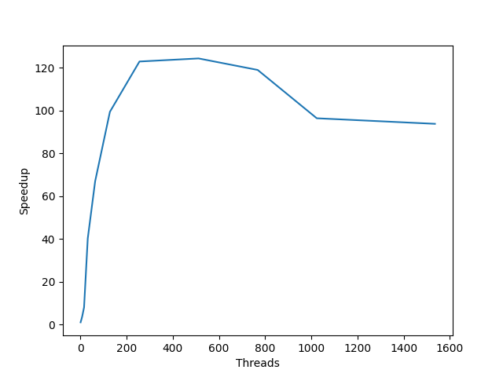
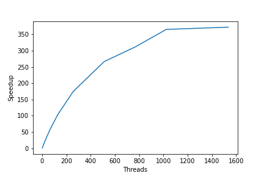
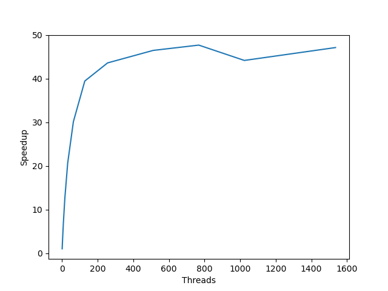

## Gustavo Bernard Schwarz 32141157

#####Objetivo: obter série de taylor convergindo para o número de euler 2.71….. Isso de maneira paralela. 

Golang foi a linguagem escolhida pois é possível trabalhar com números decimais com precisão infinita de maneira simples. Além disso é possível paralelizar o código de maneira simples com goroutines.

Uma goroutine é um thread de execução leve na linguagem de programação Go e uma função que executa simultaneamente com o restante do programa.

#### Instalar Go no Ubuntu 22.04:

```
sudo apt update
sudo apt install golang-go
```

#### Comando para rodar o código: 

```shell
go run main.go euler.go
```

Para rodar com um número específico de bits de precisao na resposta.

```shell
go run main.go euler.go <n_bits> <n_threads>

go run main.go euler.go 20000 8
```

#### Referencia de resposta:

[https://apod.nasa.gov/htmltest/gifcity/e.2mil](https://apod.nasa.gov/htmltest/gifcity/e.2mil) número de Euler com 2mi de casas decimais de precisão.

<br>

#### Resultados:

Medi os resultados de acordo com o número referência no site da nasa que tem 2 mi de casas decimais. Nos resultados é possível ver o valor de T no qual a série de Taylor alcançou, o tempo, threads, o número de bits para os números de precisão arbitrária e o tanto de casas alcançadas (number of correct decimals). 

Além disso screencast é a "captura" da tela durante toda execução do programa.

Resultados se encontram na pasta results:

O melhor até agora:

```
Converged to max precision.
Threads = 1550
T = 99200
Time = 8h58m32.374919045s
Res bits precision = 1500000
Decimal precision (number of correct decimals) = 451542
Screencast link: https://drive.google.com/file/d/16ySnVoIrIL2TpnMA1DqEa6AmFkm6Bdbi/view?usp=share_link
```


#### Estatísticas na AWS

Instancia t2.medium
 - Distributor ID: Ubuntu
 - Description:    Ubuntu 22.04.1 LTS
 - Release:        22.04
 - Codename:       jammy
 - 2 vCPU

Precision bits = 10000

| Threads |        t1 |        t2 |        t3 |    t_mean |   speedup |
|---|----------:|----------:|----------:|----------:|----------:|
| **1** | 86.6113   | 35.6052   | 31.9451   | 51.3872   |   1       |
| **2**| 16.6953   | 43.141    | 46.5097   | 35.4487   |   1.44962 |
| **4**| 24.0563   | 24.9394   | 24.0413   | 24.3457   |   2.11073 |
| **8**| 13.2298   | 12.8377   | 14.6628   | 13.5768   |   3.78494 |
| **16**|  7.22147  |  7.74812  |  4.28001  |  6.41653  |   8.00856 |
| **32**|  1.27711  |  1.27978  |  1.28171  |  1.27954  |  40.1608  |
| **64**|  0.768812 |  0.767454 |  0.768751 |  0.768339 |  66.8809  |
| **128**|  0.518584 |  0.521762 |  0.511251 |  0.517199 |  99.3567  |
| **256**|  0.418542 |  0.415209 |  0.421184 |  0.418312 | 122.844   |
| **512**|  0.411485 |  0.410814 |  0.418102 |  0.413467 | 124.284   |
| **768**|  0.433839 |  0.433866 |  0.428772 |  0.432159 | 118.908   |
| **1024**|  0.530266 |  0.531514 |  0.538492 |  0.533424 |  96.3346  |
| **1536**|  0.486262 |  0.577455 |  0.580947 |  0.548222 |  93.7344  |

**threads X speedup**



<br>

#### Estatísticas Apple m1:

 - Apple clang version 13.1.6 (clang-1316.0.21.2.5)
 - Target: arm64-apple-darwin21.3.0
 - Chip:	Apple M1 Pro
 - Total Number of Cores:	8

Precision bits = 30000

| Threads | t1 | t2 | t3 | t_mean | speedup |
|--------|-----|----|----|--------|---------|
| **1** | 591.52s | 591.31s | 592.70 | 591.84s | 1.0 |
| **2** | 297.08s | 297.07s | 296.70 | 296.95s | 1.99 |
| **4** | 149.30s | 149.65s | 150.62 | 149.85s | 3.94 |
| **8** | 75.39s | 75.37s | 75.36s | 75.37s | 7.85 | 
| **16** | 38.31s | 38.30s | 38.35s| 38.32s | 15.44 |
| **32** | 19.73s | 19.50s | 19.52s | 19.58s | 30.22 |
| **64** | 10.44s | 10.35s | 10.32s | 10.37s | 57.07 | 
| **128** | 5.74s | 5.74s | 5.76s | 5.74s | 103.10 | 
| **256** | 3.39s | 3.39s | 3.40s | 3.39s | 174.58 |
| **512** | 2.21s | 2.22s | 2.23s | 2.22s | 266.59 |
| **768** | 2.12s | 1.80s | 1.80s | 1.90s | 311.49 |
| **1024** | 1.62s | 1.62s | 1.62s | 1.62s | 365.33 |
| **1536** | 1.80s | 1.48s | 1.50s | 1.59s | 372.22 |

**threads X speedup**



Precision bits = 10000

|   threads |        t1 |        t2 |        t3 |    t_mean |   speedup |
|----------:|----------:|----------:|----------:|----------:|----------:|
|         1 | 26.3564   | 26.3531   | 26.3095   | 26.3397   |   1       |
|         2 | 13.4171   | 13.4336   | 13.4524   | 13.4344   |   1.96062 |
|         4 |  6.99337  |  6.95834  |  6.94976  |  6.96716  |   3.78055 |
|         8 |  3.73213  |  3.71453  |  3.72342  |  3.72336  |   7.07417 |
|        16 |  2.09227  |  2.0938   |  2.09323  |  2.0931   |  12.5841  |
|        32 |  1.2775   |  1.27862  |  1.27144  |  1.27585  |  20.6448  |
|        64 |  0.878737 |  0.876571 |  0.866273 |  0.87386  |  30.1417  |
|       128 |  0.661532 |  0.670407 |  0.671066 |  0.667669 |  39.4502  |
|       256 |  0.594797 |  0.59049  |  0.626849 |  0.604045 |  43.6055  |
|       512 |  0.56638  |  0.564862 |  0.569153 |  0.566798 |  46.471   |
|       768 |  0.551078 |  0.553137 |  0.55286  |  0.552358 |  47.6859  |
|      1024 |  0.606948 |  0.587375 |  0.594545 |  0.596289 |  44.1726  |
|      1536 |  0.556001 |  0.551493 |  0.569324 |  0.558939 |  47.1244  |

**threads X speedup**



<br>

#### Obs

O arquivo speedup.py faz o calculo do algoritmo pra maquina, gerando a tabela de speedup e plots.

